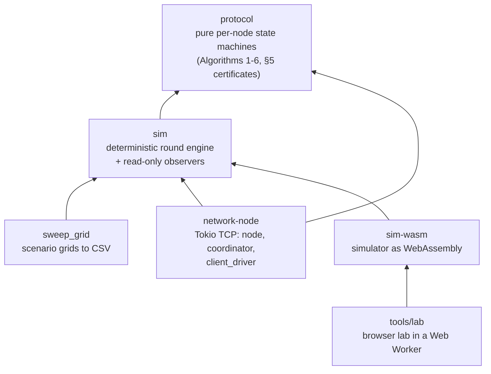

# Lightweight state machine replication

My bachelor thesis: a Rust implementation of the state machine replication protocol from "A Lightweight Approach
for State Machine Replication" by Cachin, Dou, Scheideler and Schneider
([arXiv:2509.17771](https://arxiv.org/abs/2509.17771v2)). It
includes the protocol as pure state machines, a deterministic simulator for large
experiments, a Tokio node over real TCP, and a browser lab that runs the simulator as
WebAssembly.

**Tech:** Rust · Tokio · WebAssembly · Rayon · JavaScript (Web Workers) · GitHub Actions/Pages ·
deterministic simulation

Servers agree on a shared log of
client commands with the (6,3)-median rule. Each round, a server asks a few random peers
for their logs and keeps the median.

**[Open the browser lab](https://jmenzler.github.io/lightweight-smr-blockchain/)** to step through the
protocol round by round. The simulator runs in your tab as WebAssembly. No setup.

## Architecture



Arrows point from a crate to what it depends on.

- `crates/protocol` holds the paper's Algorithms 1-6 and §5 certificates as pure per-node
  state machines with no I/O. Its README maps each step of the paper to the function that
  implements it.
- `crates/sim` drives those state machines in rounds from one seeded RNG stream, so the
  same scenario and seed give the same output. Observers measure safety, commit order,
  metrics and memory without drawing from the RNG or mutating nodes, and a regression test
  checks that. `sweep_grid` is the runner behind the thesis experiments.
- `crates/network-node` runs the same rules over real TCP sockets with Tokio: `node` per
  server, a `coordinator` that barriers each round, and a `client_driver` that resends
  pending commands until they are acknowledged. It reuses `sim`'s scenario specs.
- `crates/sim-wasm` compiles the simulator to WebAssembly. `tools/lab/` loads it in a Web
  Worker and renders it; `.github/workflows/pages.yml` rebuilds and deploys the lab on
  every push to `main`.

## Run it locally

Large experiments are better run natively, since the lab shares a browser tab with
everything else. `rustup` fetches the pinned toolchain the first time you build.

```bash
git clone https://github.com/jmenzler/lightweight-smr-blockchain && cd lightweight-smr-blockchain
cargo test --workspace                 # 929 tests
```

`sweep_grid` runs every seed of a scenario grid and writes one CSV row per run:

```bash
cat > smoke.json <<'EOF'
[{"exp": "smoke", "base": {"n": 256, "seed": 0, "k": 6, "ell": 3, "sigma": 1.0,
  "proto": {"kind": "compact", "t_commit_rounds": 40}, "injections": [],
  "max_rounds": 200, "traffic": {"kind": "pmf", "arrivals_pmf": [0.0, 1.0]},
  "schedule": {"kind": "fresh_per_round", "fraction": 0.1}},
  "ladder": [{"n": 256, "seed_base": 0, "seed_count": 4}]}]
EOF
cargo run --release --bin sweep_grid -- smoke.json smoke.csv
```

Same scenario and seed, same output. Every run also appends a line to
`.runs/sim-runs.jsonl`; set `SIM_RUNLOG=off` to skip it.

To serve the lab locally, run `python3 tools/lab/serve.py` and open
http://localhost:8791. Add `-- --ignored` if you also want the localhost TCP tests,
which are skipped by default.
